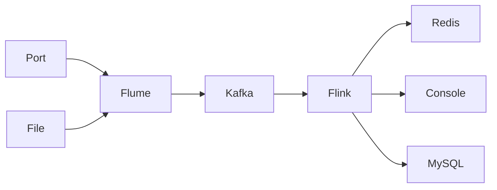

## [A : front](#front)

- ##### [关闭防火墙](#fire)

- ##### [关闭SELINUX](#SELINUX)

- #####  [时间同步](#date)


## [B : hostname/hosts](#hostname/hosts) 

- ##### [修改主机名](#hostname)

- ##### [添加映射](#hosts)

- ##### [重启机器](#reboot)

## [C : ssh](#ssh)


## [D : PATH](#PATH)

- ##### [配置`/etc/profile`](#profile)

- ##### [创建并编辑`/etc/profile.d/`下`env.sh`文件](#env)

## [E : java/scala](#java/scala)

- ##### [java](#java)

- ##### [scala](#scala)

## [F : Components](#Components)

- ##### [Hadoop](#hadoop)

- ##### [spark](#spark)

- ##### [hive](#hive)

- ##### [flink](#flink)

- ##### [Zookeeper](#zookeeper)

- ##### [Kafka](#kafka)

- ##### [Flume](#flume)


```java

          _____                    _____                    _____          
         /\    \                  /\    \                  /\    \         
        /::\    \                /::\____\                /::\____\        
       /::::\    \              /::::|   |               /:::/    /        
      /::::::\    \            /:::::|   |              /:::/    /         
     /:::/\:::\    \          /::::::|   |             /:::/    /          
    /:::/__\:::\    \        /:::/|::|   |            /:::/____/           
   /::::\   \:::\    \      /:::/ |::|   |            |::|    |            
  /::::::\   \:::\    \    /:::/  |::|   | _____      |::|    |     _____  
 /:::/\:::\   \:::\    \  /:::/   |::|   |/\    \     |::|    |    /\    \ 
/:::/__\:::\   \:::\____\/:: /    |::|   /::\____\    |::|    |   /::\____\
\:::\   \:::\   \::/    /\::/    /|::|  /:::/    /    |::|    |  /:::/    /
 \:::\   \:::\   \/____/  \/____/ |::| /:::/    /     |::|    | /:::/    / 
  \:::\   \:::\    \              |::|/:::/    /      |::|____|/:::/    /  
   \:::\   \:::\____\             |::::::/    /       |:::::::::::/    /   
    \:::\   \::/    /             |:::::/    /        \::::::::::/____/    
     \:::\   \/____/              |::::/    /          ~~~~~~~~~~          
      \:::\    \                  /:::/    /                               
       \:::\____\                /:::/    /                                
        \::/    /                \::/    /                                 
         \/____/                  \/____/                                  
                                                                           

```

## <a id="front">A : front </a>

1. <a id="fire">关闭防火墙</a>

   1.1.查看防火墙状态

   ```
   systemctl status firewalld
   ```

   1.2. 暂时关闭防火墙

   ```properties
   systemctl stop firewalld
   ```

   1.3. 永久关闭防火墙

   ```properties
   systemctl disable firewalld
   ```

   1.4. 查看防火墙状态

   ```properties
   systemctl status firewalld		#提示 Active: inactive (dead)
   则关闭成功
   ```

   

2. <a id="SELINUX">关闭SELINUX</a>

   - ```properties
     SELINUX=disabled
     ```

3. <a id="date">时间同步(可选)(5911)</a>

   - `tzselect`


## <a id="hostname/hosts">B : hostname/hosts </a>

1. <a id="hostname">修改主机名</a>

   - `vi /etc/hostname`(对应master slave1 slave2)

2. <a id="hosts">添加映射(IP <--> 主机名)</a>

   - `vi /etc/hosts`

     ```properties
      xxx.xxx.xxx master
      xxx.xxx.xxx slave1
      xxx.xxx.xxx slave2
     ```

     

3. <a id="reboot">重启机器(使修改的主机名生效)</a>

   - `reboot`


## <a id ="SSH">C : `ssh`</a>

1. 三台机器同时生成公钥
   - `ssh-keygen -t rsa`
2. 拷贝公钥到同一台机器上(如master),三台机器同时拷贝
   - `ssh-copy-id master`
3. 复制第二步上的(master)的认证到其他机器上
   - `scp -r /root/.ssh/authorized_keys slave1:/root/.ssh`
   - `scp -r /root/.ssh/authorized_keys slave2:/root/.ssh`


------

1. 主节点(master)生成公钥
   - `ssh-keygen -t rsa`
2. 拷贝至从机且自身拷贝
   - `ssh-copy-id XXX`


## <a id="PATH">D : PATH</a>

- <a id="profile">配置`/etc/profile`</a>

  ```properties
  # E:阶段环境配置
  export JAVA_HOME=/usr/local/src/jdk
  export SCALA_HOME=/usr/local/src/scala
  
  # F:阶段环境配置
  export HADOOP_HOME=/usr/local/src/hadoop
  export SPARK_HOME=/usr/local/src/spark
  export HIVE_HOME=/usr/local/src/hive
  export FLINK_HOME=/usr/local/src/flink
  
  # 其他组件
  export ZOOKEEPER_HOME=/usr/local/src/zookeeper
  export KAFKA_HOME=/usr/local/src/kafka
  export FLUME_HOME=/usr/local/src/flume
  
  
  export PATH=$PATH:$JAVA_HOME/bin:$SCALA_HOME/bin:$HADOOP_HOME/bin:$HADOOP_HOME/sbin:$SPARK_HOME/bin:$HIVE_HOME/bin:$FLINK_HOME/bin:$ZOOKEEPER_HOME/bin:$KAFKA_HOME/bin:$FLUME_HOME/bin
  ```

  

- <a id="env">创建并编辑`/etc/profile.d/`下`env.sh`文件</a>

  ```properties
  # E:阶段环境配置
  export JAVA_HOME=/usr/local/src/jdk
  export SCALA_HOME=/usr/local/src/scala
  
  # F:阶段环境配置
  export HADOOP_HOME=/usr/local/src/hadoop
  export SPARK_HOME=/usr/local/src/spark
  export HIVE_HOME=/usr/local/src/hive
  export FLINK_HOME=/usr/local/src/flink
  
  # 其他组件
  export ZOOKEEPER_HOME=/usr/local/src/zookeeper
  export KAFKA_HOME=/usr/local/src/kafka
  export FLUME_HOME=/usr/local/src/flume
  
  
  export PATH=$PATH:$JAVA_HOME/bin:$SCALA_HOME/bin:$HADOOP_HOME/bin:$HADOOP_HOME/sbin:$SPARK_HOME/bin:$HIVE_HOME/bin:$FLINK_HOME/bin:$ZOOKEEPER_HOME/bin:$KAFKA_HOME/bin:$FLUME_HOME/bin
  
  ```

- 生效

  - `. /etc/profile`
  - `soure /etc/profile`

- 验证

  - `echo $XXXX_HOME`

## <a id="java/scala">E : `java scala`</a>

- ### <a id="java">java</a>

  - 首先查看自带的并删除

    ` rpm -qa | grep java`

    `yum -y remove java-1.*`

  -  解压

    `tar -zxvf /opt/soft/jdk-8u162-linux-x64.tar.gz -C /usr/local/src/`

  - 重命名

    ` mv jdk1.8.0_162 jdk`

  - 分发

    `scp -r /usr/local/src/jdk slave1:/usr/local/src/`

    `scp -r /usr/local/src/jdk slave1:/usr/local/src/`

- ### <a id="scala">scala</a>

  - 解压

    `tar -zxvf /opt/soft/scala-2.11.0.tgz -C /usr/local/src/`

  - 重命名

  - `mv scala-2.11.0 scala`

  - 分发

    `scp -r /usr/local/src/scala slave1:/usr/local/src/`

    `scp -r /usr/local/src/scala slave1:/usr/local/src/`

## <a id="Components">F : Components</a>

- ### <a id="hadoop">F1 - Hadoop</a>

  - 解压

    `tar -zxvf /opt/soft/hadoop-2.7.7.tar.gz -C /usr/local/src/`

  - 重命名

    `mv hadoop-2.7.7 hadoop`

  - 配置文件(六个)

    - `hadoop-env.sh`

      ```properties
      #原内容
      # The java implementation to use.
      export JAVA_HOME=${JAVA_HOME}
      #修改为(jdk的绝对路径)
      # The java implementation to use.
      export JAVA_HOME=/usr/local/src/jdk
      ```

      

    - `core-site.xml`

      ```xml
      <property>
        <!--namenode的URL地址-->
        <name>fs.defaultFS</name>
        <value>hdfs://master:9000</value>
      </property>
      
      <property>
        <!--hadoop临时文件路径-->
        <name>hadoop.tmp.dir</name>
        <value>/opt/data/hadoop</value>
      </property>
      ```

      

    - `hdfs-site.xml`

      ```xml
      <property>
        <!--hadoop的副本数量，默认为3-->
        <name>dfs.replication</name>
        <value>3</value>
      </property>
      ```

      

    - `yarn-site.xml`

      ```xml
      <property>
      <name>yarn.resouremanager.hostname</name>
      <value>master</value>
      </property>
      
      <property>
      <name>yarn.nodemanager.aux-services</name>
      <value>mapreduce_shuffle</value>
      </property>
      
      <!--关闭虚拟内存验证-->
      <property>
      <name>yarn.nodemanager.vmem-check-enabled</name>
      <value>false</value>
      </property>
      
      <!--关闭物理内存验证-->
      <property>
      <name>yarn.nodemanager.pmem-check-enabled</name>
      <value>false</value>
      </property>
      ```

      

    - `mapred-site.xml`(需复制`mapred-site.xml.template`)

      ```xml
      <property>
      <name>mapreduce.framework.name</name>
      <value>yarn</value>
      </property>
      ```

      - 修改`slaves`

        ```
        master
        slave1
        slave2
        ```

        

  - 分发

    `scp -r /usr/local/src/scala slave1:/usr/local/src/`

    `scp -r /usr/local/src/scala slave1:/usr/local/src/`

  - 格式化

    `hdfs namenode -format`

  - 查看`jps`进程

    ```properties
    #slave1
    7234 NodeManager
    7362 Jps
    5931 DataNode
    
    
    #slave2
    7057 NodeManager
    7185 Jps
    5732 DataNode
    
    
    #master
    2304 ResourceManager
    2736 Jps
    2137 SecondaryNameNode
    1963 DataNode
    1821 NameNode
    2591 NodeManager
    
    
    ```

  - 运行自带案例

    ```properties
    hadoop jar $HADOOP_HOME/share/hadoop/mapreduce/hadoop-mapreduce-examples-2.7.7.jar pi 10 10
    ```

    

- ### <a id="spark">F2 - Spark</a>

  - 解压

    `tar -zxvf /opt/soft/spark-2.1.1-bin-hadoop2.7.tgz -C /usr/local/src/`

  - 重命名

    `mv spark-2.1.1-bin-hadoop2.7 spark`

  - 配置文件(两个,需复制spark-env.sh.template 和slaves.template )

    - `spark-env.sh`

      ```properties
      export JAVA_HOME=/usr/local/src/jdk
      export HADOOP_CONF_DIR=/usr/local/src/hadoop/etc/hadoop
      
      export SPARK_MASTER_PORT=7070
      export SPARK_MASTER_HOST=master
      
      export SPARK_CONF_DIR=/usr/local/src/spark/conf
      
      ```

    - `slaves`

      ```properties
      master
      slave1
      slave2
      ```

    

  - 分发

    `scp -r /usr/local/src/spark slave1:/usr/local/src/`

    `scp -r /usr/local/src/spark slave2:/usr/local/src/`

  - 查看jps进程

    ```properties
    #slave1
    7334 Jps
    7256 Worker
    
    
    
    #slave2
    7334 Jps
    7351 Worker
    
    
    
    #master
    3075 Jps
    3012 Worker
    2917 Master
    
    ```

  - 运行自带案例

    `spark-submit --class org.apache.spark.examples.SparkPi --master yarn /usr/local/src/spark/examples/jars/spark-examples_2.11-2.1.1.jar 100`

  

- ### <a id="hive">F3 - Hive</a>

  - 解压

    `tar -zxvf /opt/soft/apache-hive-2.3.4-bin.tar.gz -C /usr/local/src/`

  - 重命名

    `mv apache-hive-2.3.4-bin hive`

  - 配置文件(一个,需复制 ` hive-default.xml.template `        改五  删三)

    ` cp hive-default.xml.template hive-site.xml`

    `vi hive-site.xml`
    
    - 改动五处(数据库链接地址,驱动 , 用户名 , 密码,版本效验)
    
      ```xml
        <property>
          <name>javax.jdo.option.ConnectionURL</name>
          <value>jdbc:mysql://localhost:3306/hiveNo12?createDatabaseIfNotExist=true&amp;characterEncoding=UTF-8&amp;useSSL=false</value>
        </property>
      
        <property>
          <name>javax.jdo.option.ConnectionDriverName</name>
          <value>com.mysql.jdbc.Driver</value>
        </property>
      
        <property>
          <name>javax.jdo.option.ConnectionUserName</name>
          <value>root</value>
          <description>Username to use against metastore database</description>
        </property>
      
        <property>
          <name>javax.jdo.option.ConnectionPassword</name>
          <value>123456</value>
        </property>
      
       <property>
          <name>hive.metastore.schema.verification</name>
          <value>false</value>
        </property>
      
      
      
      
      ```
    
    - 删除三处
    
      ```xml
        <property>
          <name>hive.querylog.location</name>
          <value></value>
          <description>Location of Hive run time structured log file</description>
        </property>
      
        <property>
          <name>hive.downloaded.resources.dir</name>
          <value></value>
          <description>Temporary local directory for added resources in the remote file system.</description>
        </property>
      
        <property>
          <name>hive.exec.local.scratchdir</name>
          <value></value>
          <description>Local scratch space for Hive jobs</description>
        </property>
      
      
      ```
    
  - 将mysql的驱动包拷贝至 hive/lib下

  - 初始化hive元数据

    ` schematool -dbType mysql -initSchema`

  - 进入hive验证

- ### <a id="flink">F4 - Flink</a>

  - 解压

    `tar -zxvf /opt/soft/flink-1.10.2-bin-scala_2.11.tgz -C /usr/local/src/`

  - 重命名

    `mv flink-1.10.2 flink`

  - 配置文件
  
    - `flink-conf.yaml`(注意冒号后有空格)

      ```yaml
      jobmanager.rpc.address: master
      ```
  
    - `slaves`
  
      ```properties
      master
      slave1
      slave2
      ```

    - 分发

      `scp -r /usr/local/src/flink slave1:/usr/local/src/`

      `scp -r /usr/local/src/flink slave2:/usr/local/src/`
  
    - 查看jps进程(注意,因端口冲突,启动flink之前需要先停止park的相关进程)
  
       ```properties
       #slave1
       7334 Jps
       7687 TaskManagerRunner
       
       
       
       #slave2
       7334 Jps
       7687 TaskManagerRunner
       
       
       
       
       #master
       3553 StandaloneSessionClusterEntrypoint
       3917 TaskManagerRunner
       3999 Jps
       
       ```

  - 运行案例(on yarn 运行需先执行 `export HADOOP_CLASSPATH=hadoop classpath`)
  
    - `flink run /usr/local/src/flink/examples/batch/WordCount.jar `
  
    1. ``` shell
        export HADOOP_CLASSPATH=`hadoop classpath`
    
    2. ```
       flink run -m yarn-cluster /usr/local/src/flink/examples/batch/WordCount.jar
       ```
  
- <a id="zookeeper">F5-Zookeeper</a>

  - 解压

  - 复制&配置文件`cp zoo_sample.cfg zoo.cfg`

    - `vi zoo.cfg`

    - ```properties
      dataDir=/usr/local/src/zookeeper/data
      server.1=master:2888:3888
      server.2=slave1:2888:3888
      server.3=slave2:2888:3888
      ```

  - 创建文件夹&编辑`myid`文件

    - `mkdir /usr/local/src/zookeeper/data`

    - `vi myid`( myid需对应配置文件中的server.X )

      ```
      X #(此处为数字)
      ```

    

  - 分发集群

- <a id="kafka">F6-Kafka</a>

  - 解压

  - 配置文件(改三增一)

    - `vi server.properties`

    - ```properties
      broker.id=1
      
      #推荐使用具体IP跟上端口号
      host.name=XXX.XXX.XXX.XXX:9092
      
      listeners=PLAINTEXT://XXX.XXX.XXX.XXX:9092
      
      zookeeper.connect=XXX.XXX.XXX.XXX:2181,XXX.XXX.XXX.XXX:2181,XXX.XXX.XXX.XXX:2181
      ```

    - 

  - 分发

  - 启动服务

    - ```shell
      kafka-server-start.sh -daemon /usr/local/src/kafka/config/server.properties
      ```

  - 创建主题

    - ```shell
      kafka-topics.sh --create --zookeeper master:2181 --replication-factor 1 --partitions 1 --topic topicName
      ```

  - 查看主题

    - ```shell
      kafka-topic.sh --zookeeper master:2181 --list
      ```

  - 删除主题

    - ```shell
      kafka-topics.sh --zookeeper master:2181 --delete --topic topicName
      ```

  - 启动生产者

    - ```shell
      kafka-console-producer.sh --broker-list master:9092 --topic topicName
      ```

  - 启动消费者

    - ```shell
      kafka-console-consumer.sh --bootstrap-server master:9092 --topic topicName --from-beginning
      ```

- <a id="flume">F7-Flume</a>

  - 解压
  
  - 创建&编辑文件
  
    - 监听文件变化,输出到控制台
  
      ```properties
      #采集器组件起名字
      a1.sources=r1
      a1.channels=c1
      a1.sinks=k1
      
      #数据来源描述(来自于文件)
      a1.sources.r1.type=exec
      a1.sources.r1.command=tail -F /opt/flume.txt
      
      #数据缓存描述(缓存到内存)
      a1.channels.c1.type=memory
      
      #描述数据sink到哪(logger --> 输出到控制台)
      a1.sinks.k1.type=logger
      
      #关联组件
      a1.sources.r1.channels=c1
      a1.sinks.k1.channel=c1
      ```
  
    - 监听端口
  
      ```properties
      #采集器命名
      a1.sources=r1
      a1.channels=c1
      a1.sinks=k1
      
      #数据来源(来自于端口)
      a1.sources.r1.type=netcat
      a1.sources.r1.bind=master
      a1.sources.r1.port=26001
      #数据缓存描述(缓存到内存)
      a1.channels.c1.type=memory
      #数据输出到控制台
      a1.sinks.k1.type=logger
      
      #关联组件
      a1.sources.r1.channels=c1
      a1.sinks.k1.channel=c1
      ```
  
    - 监听端口,sink到Kafka
  
      ```properties
      a1.sources=r1
      a1.channels=c1
      a1.sinks=k1
      
      a1.sources.r1.type=netcat
      a1.sources.r1.bind=master
      a1.sources.r1.port=26001
      
      a1.channels.c1.type=memory
      
      a1.sinks.k1.type=org.apache.flume.sink.kafka.KafkaSink
      a1.sinks.k1.kafka.bootstrap.servers=master:9092,slave1:9092,slave2:9092
      a1.sinks.k1.kafka.topic=flumeTest
      
      a1.sources.r1.channels=c1
      a1.sinks.k1.channel=c1
      ```
  
    - 启动flume采集器进行数据采集
  
      ```shell
      `flume-ng agent -c conf -f/usr/local/src/flume/conf/file.conf --name a1 -Dflume.root.logger=INFO,console
      ```
  


------





### Sqoop

- 解压配置环境变量

- ```properties
  #Set path to where bin/hadoop is available
  export HADOOP_COMMON_HOME=/usr/local/src/hadoop
  
  #Set path to where hadoop-*-core.jar is available
  export HADOOP_MAPRED_HOME=/usr/local/src/hadoop
  
  #set the path to where bin/hbase is available
  #export HBASE_HOME=
  
  #Set the path to where bin/hive is available
  #export HIVE_HOME=/usr/local/src/hive
  
  #Set the path for where zookeper config dir is
  export ZOOCFGDIR=/usr/local/src/zookeeper/conf
  
  ```

- ```
  sqoop list-databases --connect jdbc:mysql://localhost:3306/ --username root -P
  
  ```

- 
